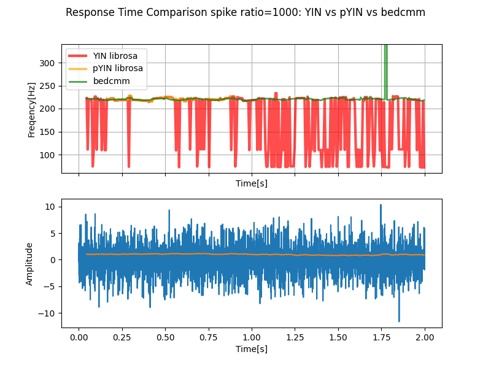
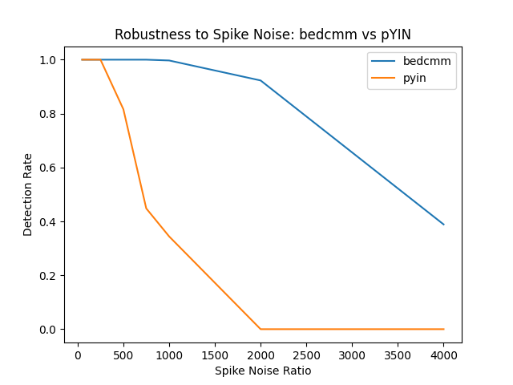

# bedcmmPitch
## ピッチ検出アルゴリズム
周期性解析手法を用いたピッチ検出のアルゴリズムで、研究、PoCで用いるためのリポジトリです。
Pitchを計算するcalc_Pitch関数と途中の周期性解析の情報を出力するcalc_bedcmmの二つの関数があります。
スパイク状のノイズに対して強いピッチ検出手法です。

## スパイクノイズに対するロバスト性（pYINとの比較）

本手法を、librosa に実装されている pYIN と、スパイクノイズ環境下で比較しました。

### 結果

#### 時系列比較（スパイク比 = 1000）

- YINはスパイクノイズ下で大きなピッチ誤差が発生する
- pYINはより安定しているが、ノイズの影響で劣化する
- bedcmmは安定した推定を維持する

#### スパイクノイズに対する検出率

検出率は、推定ピッチが真値に対して±5%以内に収まるフレームの割合として定義しています。

### 実験条件
- 信号：220 Hz のサイン波
- サンプリング周波数：44.1 kHz
- スパイクノイズ：振幅比を変化させたランダムインパルス（`simulation_test.py`参照）
- ウィンドウサイズ：2048
- ホップサイズ：256

### 注意事項
- pYINはlibrosaのデフォルトパラメータを使用
- bedcmmは特に記載がない限りデフォルトパラメータを使用
- 再現用スクリプトは `simulation_test.py` に含まれています

### まとめ
bedcmmは、pYINと比較してスパイクノイズに対して有意に高いロバスト性を示します。

## bedcmmについて
パターン抽出を用いて周期性解析を行うコアアルゴリズムです。

詳細はこちら
https://github.com/YASUHARA-Wataru/bedcmm

## ライブラリについて
- numpy
- cython
- matplotlib

下記のコマンドでインストールできます:

pip install numpy cython matplotlib

## 関数
- calc_Pitch
    - input(default) : datade description
        - data               : 1D array data(signal data)
        - fs(44100)          : float(sampling rate)
        - window_size(2048)  : int(window size)
        - hop_size(256)      : int(hop size)
        - pitch_range(None)  : [start_freq, end_freq](range of search)
        - pp_mode('positive+negative'): str(perprocessing mode('positive','negative','positive+negative','threshould_diff'))
        - pp_threshould(0)   : float(perprocessing threshould(using in 'threshould_diff mode'))
        - bedcmm_smooth(3)   : int(bedcmm result smoothing size(if size 1 means do not smoothing))
        - pitch_detect_mode('peak'): str(bedcmm result peak detect mode(using in 'score','static','maximum','peak'))
        - pitch_detect_thre(0.85): float(bedcmm result peak detect threshould(using in 'score','static','peak'))
        - interpolator_mode('parabolic'): str(peak index interpolator mode('parabolic','centroid','gaussian', 'no'))
    - output
        - Pitch data:1D array data(pitch data)
        - score data:1D array data(bedcmm score)
- calc_bedcmm
    - input
        - data               : 1D array data(signal data)
        - fs(44100)          : float(sampling rate)
        - window_size(2048)  : int(window size)
        - hop_size(256)      : int(hop size)
        - pitch_range(None)  : [start_freq, end_freq](range of search)
        - pp_mode('positive'): str(perprocessing mode('positive','negative','positive+negative','threshould_diff'))
        - pp_threshould(0)   : float(perprocessing threshould(using in 'threshould_diff mode'))
    - output
        - bedcmm data:2D array data(time,bedcmm)
        - mean data:1D array data(time)

## 注意点
基本的にデフォルトパラメータで動かしてください。
差異はあると思うので、興味があればパラメータを変更してみてください。
pitch_detect_threは、pitch_detect_modeがsocreの時は、入力信号の平均値と閾値の掛け算で、bedcmmの結果の閾値を作成します。また、pitch_detect_modeがstaticの時は、そのまま閾値として用います。また、peakの時は、計算している、bedcmmの最大ピーク値と閾値の掛け算となります。
pitch_detect_modeがmaxの時は、pitch_rangeを絞らないとうまく機能しません。
また、pp_modeは、デフォルトは精度が出やすく、計算が重い設定になっています。
計算を早くしたい場合は、'positive'、'negative'といったモードも使えます。
また、pp_modeのthreshould_diffは、全て正の値になるように設定しなければ、うまくscoreが機能しません。

## 簡易的なインストール方法
1. フォルダ「bedcmmPitch」を作業フォルダにコピー
2. 「setup.py」を作業フォルダににコピー
3. numpy、cython、setuptools(、matplotlib(main表示用のため))がライブラリに入っている事を確認
    1. 上記ライブラリが無ければ、uvやpipで導入
4. 作業フォルダにいて、環境が動く状態でプロンプトから「python setup.py build_ext --inplace」の実行
5. main.pyの実行(動作確認)

※4.は飛ばしてもpure python実装が動きます。

## ライセンスについて

本リポジトリのコードは、**研究・評価・技術検証（PoC）目的に限り**利用可能です。

### 利用可能な範囲

* 研究用途での利用
* アルゴリズム評価・検証
* 技術検証（PoC）

PoC用途については、**期間制限なく自由にご利用いただけます。**

### 禁止事項

以下の利用は禁止されています：

- 商用利用（製品・サービスへの組み込み、収益化を伴う利用）
- 本番環境での利用（運用システムへの組み込みを含む）

### 商用利用について

商用利用または本番環境での利用をご希望の場合は、
**別途ライセンス契約が必要です。**

ご相談は Issue または直接ご連絡ください。

### 免責事項

本ソフトウェアは現状有姿（AS IS）で提供されます。
本ソフトウェアの利用によって生じたいかなる損害についても、作者は一切の責任を負いません。

---

※詳細な利用条件は `LICENSE` ファイルをご確認ください。

## 連絡先
商用利用したい場合は、あなたの使い方（ユースケース）を教えて連絡してください
fapow.contact[at]gmail.com

## 特許に関する注意

本リポジトリには、日本で特許取得されている技術に関連する実装が含まれます。

当該特許権は現在、日本国内において有効です。
ただし、本リポジトリおよび関連技術の商用利用を許諾するものではありません。

商用利用または製品への組み込みを検討する場合は、事前にご連絡ください。